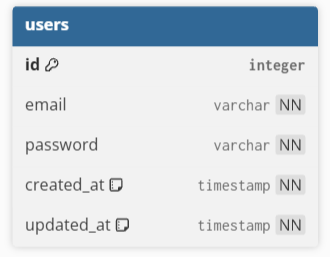

# ReadySetGo
Aplikacja - System Rezerwacji Usług Sportowych

> ReadySetGo to kompleksowa aplikacja mobilna wspierająca zdrowy tryb życia, aktywność fizyczną oraz integrację sportową. Pomaga użytkownikom w osiąganiu ich celów sylwetkowych i kondycyjnych, a także ułatwia organizację wspólnych treningów.

## Główne funkcje aplikacji
* **Personalizacja i śledzenie postępów:** Konfiguracja profilu pod konkretne cele (np. utrata wagi, budowa masy mięśniowej), dobór poziomu zaawansowania oraz monitorowanie statystyk ciała.
* **Dziennik treningowy:** Wbudowany kalendarz pozwalający na planowanie przyszłych aktywności i rejestrowanie odbytych treningów.
* **Aktywności i Mapa:** Wybór spośród wielu dyscyplin sportowych oraz znajdowanie wydarzeń i miejsc do gry w najbliższej okolicy za pomocą interaktywnej mapy.
* **Dobieranie przeciwników:** Możliwość tworzenia spotkań sportowych i szukania partnerów do gry z uwzględnieniem ich poziomu zaawansowania (system ELO).

**Odznaki**:


---

## Wizja Projektu

### **Problem:**

Małe studia fitness i trenerzy tracą czas na ręczne odpisywanie na wiadomości i telefony w sprawie zapisów. Klienci rezygnują z usług, gdy nie mogą sprawdzić dostępności terminu "tu i teraz" (np. późno wieczorem), co powoduje:

* próba
* brak kontroli nad liczbą miejsc,
* błędy w zapisach,
* trudności w zarządzaniu grafikiem,
* brak historii rezerwacji

### **Użytkownik:**

**_Klient:_** 	Osoba aktywna, ceniąca czas, chcąca zarezerwować trening w 3 kliknięcia.

**_Administrator/Trener:_** Profesjonalista potrzebujący czystego wglądu w grafik i 		automatyzacji powiadomień.

### **Wartość biznesowa:**

* Automatyzacja zapisów
* Oszczędność czasu
* Lepsza organizacja pracy
* Możliwość dalszej rozbudowy (np. płatności online)

### **Diagram przykładu użycia:**


---

## System rezerwacji usług sportowo rekreacyjnych

| Funkcjonalności           | Opis                                                 |
|---------------------------|------------------------------------------------------|
| **Autentykacja**          | Rejestracja i logowanie                              |
| **Przegląd Zajęć**        | Przeglądaj dostępne zajęcia                          |
| **Rezerwacja terminów**   | Rezerwój terminy zajęć                               |
| **Anulowanie**            | Anuluj swoje rezerwacje                              |
| **Panel administratora**  | Panel Administratora posiadający dostęp do strony    |

---


## Roadmap

**W Jira**

---

## MVP

**Minimalna wersja systemu obejmuje:**
- Konto użytkownika
- Rezerwację zajęć
- Połączenie z bazą danych
- Podstawowy panel admina

---

## Klasy dla branchy

**Sposób tworzenia brancha:**

`prefix`/`{Opis problemu}`

| Prefix       | Opis                                                                       |
|--------------|----------------------------------------------------------------------------|
| **feat**     | Nowa funkcjonalność (np. dodanie rezerwacji).                              |
| **fix**      | Naprawa błędu.                                                             |
| **docs**     | Zmiany w dokumentacji (readme, javadoc).                                   |
| **style**    | Zmiany formatowania, brakujące średniki, itd. (nie wpływa na logikę kodu). |
| **refactor** | Zmiana kodu, która ani nie naprawia błędu, ani nie dodaje funkcji.         |
| **chore**    | Zmiany w procesie budowania, narzędziach pomocniczych.                     |
| **ci**       | Zmiany w konfiguracji CI/CD, GitHub Actions, skryptach deploymentu.        |


---

## Styl dla PR'ów

| Typ        | Subtype           | Issue          | Podsumowanie      |
|------------|-------------------|----------------|-------------------|
| **Prefix** | **Prefix**,**Prefix** | *Issue z Jiry* | *Krótki opis*     |

**Przykład:**

| Typ      | Subtype | Issue     | Podsumowanie                             |
|----------|---------|-----------|------------------------------------------|
| **Docs** |         | **RSG-6** | Zmiana dokumentacji, dodano nowy wygląd. |

---

## Architektura

#### Architektura w skrócie

```
Android App (frontend)
       ↕ HTTP/REST
Ktor Server (backend)
       ↕ JDBC + HikariCP
PostgreSQL (database)
```

#### Struktura docelowa typu *MVVM* dla plików projektu:

```
ReadySetGo/
├── .github/                  # Konfiguracja CI/CD (GitHub Actions)
├── backend/                  # Ktor REST API + JDBC + PostgreSQL
│   ├── docker/               # Docker Compose + skrypty bazy danych (init.sql)
│   ├── scripts/              # Skrypty wdrożeniowe (deploy)
│   ├── src/main/
│   │   ├── kotlin/com/ReadySetGo/backend/
│   │   │   ├── config/       # Konfiguracja bazy i puli połączeń
│   │   │   ├── controller/   # Endpointy REST API
│   │   │   ├── model/        # Modele domenowe
│   │   │   ├── repository/   # Zapytania JDBC
│   │   │   ├── service/      # Logika biznesowa
│   │   │   ├── Application.kt
│   │   │   └── Seeder.kt
│   │   └── resources/        # application.conf, logback.xml
│   ├── Dockerfile            # Konfiguracja obrazu Docker
│   ├── railway.toml          # Konfiguracja środowiska produkcyjnego
│   └── build.gradle.kts
│
├── frontend/                 # Android App (MVVM + Hilt + Retrofit)
│   ├── app/src/main/
│   │   ├── java/com/ReadySetGo/frontend/
│   │   │   ├── data/         # Repozytoria, modele, API (Retrofit)
│   │   │   ├── di/           # Moduły wstrzykiwania zależności (Hilt)
│   │   │   ├── ui/           # Ekrany i komponenty interfejsu
│   │   │   │   ├── auth/
│   │   │   │   ├── components/
│   │   │   │   ├── detail/
│   │   │   │   ├── home/
│   │   │   │   ├── journal/
│   │   │   │   ├── navigation/
│   │   │   │   ├── onboarding/
│   │   │   │   ├── profile/
│   │   │   │   └── theme/
│   │   │   └── utils/        # Klasy pomocnicze (MainActivity.kt)
│   │   ├── res/              # Zasoby aplikacji (drawable, values, xml)
│   │   └── AndroidManifest.xml
│   └── build.gradle.kts
│
├── shared/                   # Udostępniane zasoby (obecnie puste)
│   └── .gitkeep
│
├── .env.example              # Szablon zmiennych środowiskowych
├── d1.png                    # Diagram przykładu użycia
├── erd.png                   # Schemat bazy danych (ERD)
├── pull_request_template.md  # Szablon opisów dla PR
└── README.md
```

---

## PostgreSQL Struktura danych

```
TBD
```

---

## Tech Stack

### Narzędzia
| Narzędzie          | Zastosowanie                                   |
|--------------------|------------------------------------------------|
| **IntelliJ IDEA**  | Backend development                            |
| **Android Studio** | Frontend development                           |
| **Docker Desktop** | Startowanie bazy PostgreSQL lokalnie           |
| **Railway**        | Hosting backend (staging + production)         |
| **GitHub**         | Główne repozytorium projektu / kontrola wersji |
| **Jira**           | Organizacja pracy zespołu                      |

Otwórz oba IDEs obok siebie — IntelliJ dla `backend/`, Android Studio dla `frontend/`.

### Technologie

| Warstwa       | Technologia                       |
|---------------|-----------------------------------|
| Backend       | **Ktor 2.x (Netty)**              |
| DB Bridge     | **JDBC** + **HikariCP**           |
| Database      | **PostgreSQL 16 (Docker)**        |
| Android UI    | **Jetpack Compose**               |
| Architecture  | **MVVM** + **Repository pattern** |
| DI            | **Hilt**                          |
| HTTP Client   | **Retrofit 2** + **OkHttp**       |
| Async         | **Coroutines** + **StateFlow**    |
| Repository    | **GitHub**                        |
| Workflow      | **Jira**                          |
| Authenticate  | **JWT** + **BCrypt**              |

---

## Używanie aplikacji

### Wymagania

- [Docker Desktop](https://www.docker.com/products/docker-desktop)
- [Android Studio](https://developer.android.com/studio) — frontend
- [IntelliJ IDEA Community](https://www.jetbrains.com/idea/) — backend
- JDK 17+

### 1. Sklonuj repozytorium

```powershell
git clone https://github.com/szajam/ReadySetGo.git
cd ReadySetGo
```

### 2. Skopiuj zmienne środowiskowe
```powershell
copy .env.example .env
```
Wypełnij swoje wartości zmiennych w `.env`.

### 3. Wystartuj baze danych
```powershell
cd backend/docker
.\start-db.ps1
```

#### Dla zatrzymania bazy danych odpowiednio:
```powershell
cd backend/docker
.\stop-db.ps1
```

#### Dla dodania podstawowych danych do bazy danych:
```powershell
cd backend/docker
.\seed.ps1
```

### 4. Wystartuj backend
```powershell
cd backend
.\gradlew.bat run
```

### 5. Sprawdź czy backend działa
```powershell
curl.exe http://localhost:8080/health
# {"status":"ok","database":"connected"}
```

### 6. Wystartuj aplikacje Android
1. Otwórz w Android Studio: **File → Open** → select `ReadySetGo/frontend`
2. Poczekaj na Gradle sync
3. Połącz się do urządzenia lub wystartuj emulator.
4. Kliknij **Run ▶️** lub naciśnij `Shift+F10`

Aplikacja łączy się do `http://10.0.2.2:8080` co przekierowuje ją na lokalny backend.

---

## Zmienne środowiskowe .env

W `.env.example` zawarte są wszystkie wymagane zmienne środowiskowe.

**Nigdy nie dodawaj do commit'a `.env`!**

| Zmienna                           | Domyślna wartość | Opis                                   |
|-----------------------------------|------------------|----------------------------------------|
| DB_HOST                           | localhost        | PostgreSQL host                        |
| DB_PORT                           | 5432             | PostgreSQL port                        |
| DB_NAME                           | db_name          | Nazwa bazy danych                      |
| DB_USER                           | db_user          | Użytkownik bazy danych                 |
| DB_PASSWORD                       | db_password      | Hasło bazy danych                      |
| KTOR_PORT                         | 8080             | Backend server port                    |
| JWT_SECRET                        | abcd1234         | Sekret JWT                             |
| JWT_ISSUER                        | rsg_issuer       | Nazwa issuer'a JWT                     |
| JWT_AUDIENCE                      | rsg_users        | Nazwa audiencji JWT                    |
| JWT_EXPIRATION_MS                 | 86400000         | Czas wygaśnięcia JWT                   |
| RAILWAY_TOKEN                     |                  | Twój osobisty token Railway API        |
| RAILWAY_STAGING_SERVICE_ID        |                  | ID serwisu backendowego na staging'u   |
| RAILWAY_STAGING_ENVIRONMENT_ID    |                  | ID środowiska staging'u na Railway'u   |
| RAILWAY_PRODUCTION_SERVICE_ID     |                  | ID serwisu backendowego na produkcji   |
| RAILWAY_PRODUCTION_ENVIRONMENT_ID |                  | ID środowiska produkcji na Railway'u   |

---

## Docker

Baza danych jest zarządzana poprzez Docker Compose.
Używaj podanych skryptów zamiast surowych komend `docker compose`.
One automatycznie ustawiają ścieżkę do pliku `.env`.

| Skrypt                        | Działanie                           |
|-------------------------------|-------------------------------------|
| `backend/docker/start-db.ps1` | Wystartuj kontener PostgreSQL       |
| `backend/docker/stop-db.ps1`  | Zatrzymaj kontener PostgreSQL       |
| `backend/docker/seed.ps1`     | Seeduje testowe dane do bazy danych |

---

## CI/CD

Projekt używa GitHub Actions do automatycznego budowania i deploymentu.

### Workflows

| Workflow               | Wyzwalacz                  | Działanie                                     |
|------------------------|----------------------------|-----------------------------------------------|
| `ci.yml`               | PR do `staging` lub `main` | Buduje backend i frontend, uruchamia testy    |
| `deploy-staging.yml`   | Push do `staging`          | Triggeruje redeploy na Railway staging        |

### Flow pracy zespołu

```
feature/nazwa-zadania
        ↓ PR → staging
CI sprawdza build + testy
        ↓ merge
GitHub Actions triggeruje Railway deploy
        ↓ weryfikacja
PR staging → main
        ↓ merge
Railway deployuje na produkcję (manualnie)
```

### Manualne deployowanie na staging

```powershell
cd backend/scripts
.\deploy-staging.ps1
```

Wymaga zmiennych `RAILWAY_TOKEN`, `RAILWAY_STAGING_SERVICE_ID`, `RAILWAY_STAGING_ENVIRONMENT_ID` w `.env`.

---

## Railway (Staging & Production)

Backend jest hostowany na [Railway](https://railway.app).

### Środowiska

| Środowisko    | Branch    | Deploy                   |
|---------------|-----------|--------------------------|
| `staging`     | `staging` | Auto po każdym push'u    |
| `production`  | `main`    | Manualnie po weryfikacji |

### Konfiguracja dla nowego dewelopera backendu

1. Poproś team leadera o dostęp do projektu Railway
2. Pobierz ze swojego konta Railway **API Token**
3. Pobierz od team leadera:
    - `RAILWAY_STAGING_SERVICE_ID`
    - `RAILWAY_STAGING_ENVIRONMENT_ID`
4. Dodaj wszystkie trzy do swojego `.env`

### GitHub Secrets (team leader)

W repozytorium → Settings → Secrets and variables → Actions dodaj:

| Secret                           | Opis                             |
|----------------------------------|----------------------------------|
| `RAILWAY_TOKEN`                  | Token Railway dla GitHub Actions |
| `RAILWAY_STAGING_SERVICE_ID`     | ID serwisu staging'u             |
| `RAILWAY_STAGING_ENVIRONMENT_ID` | ID środowiska staging'u          |

---

## API

| Metoda | Endpoint       | Opis                     |
|--------|----------------|--------------------------|
| GET    | /health        | Server + database status |
| POST   | /auth/register | Rejestracja użytkownika  |
| POST   | /auth/login    | Logowanie użytkownika    |

Więcej endpoint'ów się pojawi w ciagu projektu.

---

## Paleta kolorów

| Token          | Kolor (Hex)       | Zastosowanie                               |
|----------------|-------------------|--------------------------------------------|
| `DarkNavy`     | #192126           | Główny kolor aplikacji (Primary), teksty   |
| `LimeGreen`    | #BBF246           | Główne akcenty, przyciski (Secondary)      |
| `Orange`       | #F97316           | Dodatkowe wyróżnienia (Tertiary)           |
| `Sand`/`Brown` | #C1A188 / #544026 | Kolory uzupełniające marki                 |
| `ErrorRed`     | #E53935           | Komunikaty o błędach i ostrzeżenia         |
| `InputGray`    | #F0F0F0           | Tła pól tekstowych (Surface)               |

---

## Schemat Bazy Danych (ERD)

Wstępny diagram struktury bazy danych. Z czasem będą tu dodawane kolejne relacje.



---

## Typografia

| Styl (Token) | Rozmiar | Waga     | Zastosowanie                     |
|--------------|---------|----------|----------------------------------|
| `header28`   | 28sp    | Bold     | Główne nagłówki, duże tytuły     |
| `header24`   | 24sp    | Bold     | Mniejsze nagłówki, podtytuły     |
| `text16`     | 16sp    | Normal   | Główny tekst czytany, akapity    |
| `text14`     | 14sp    | Normal   | Mniejszy tekst, opisy pomocnicze |
| `label16`    | 16sp    | SemiBold | Tekst przycisków, ważne etykiety |

